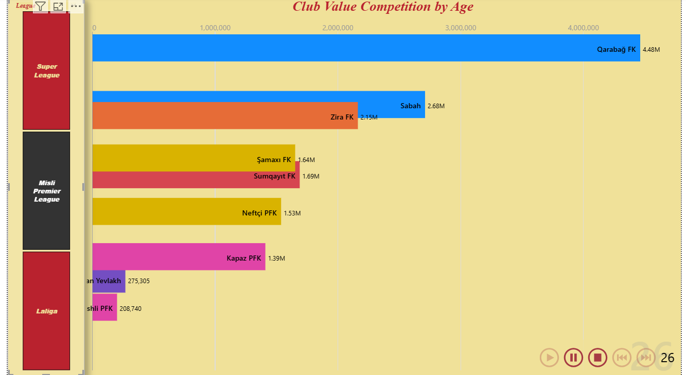
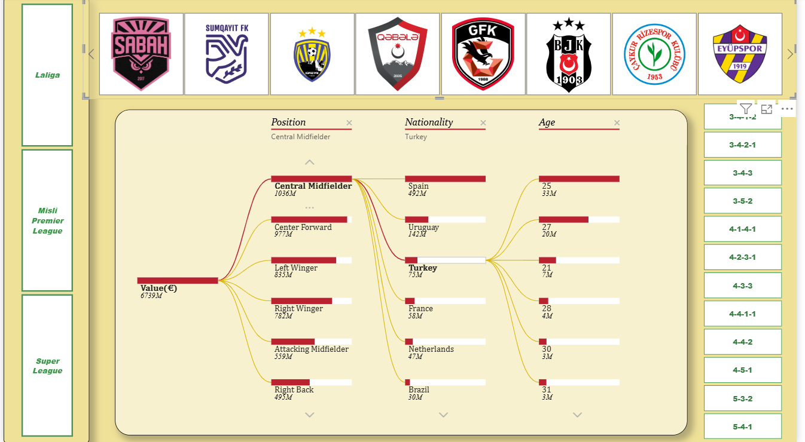
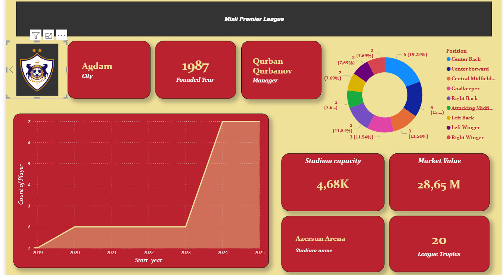
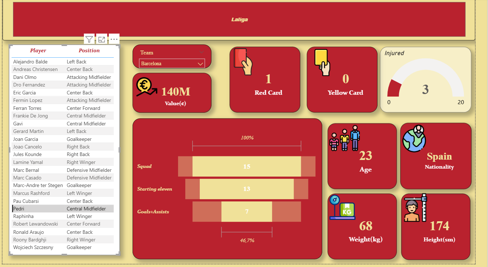
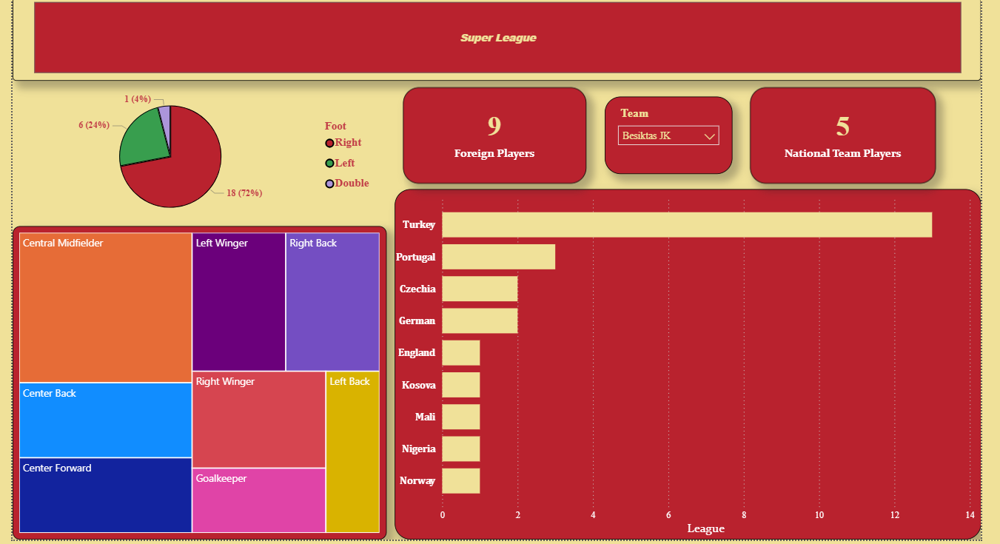
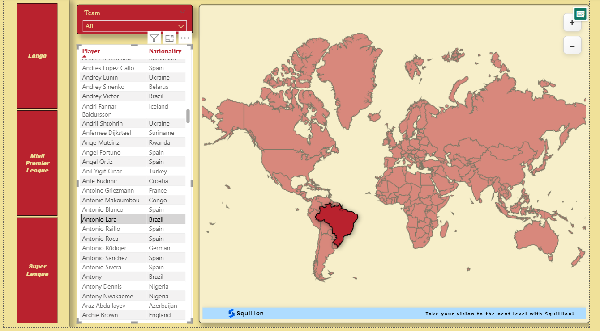
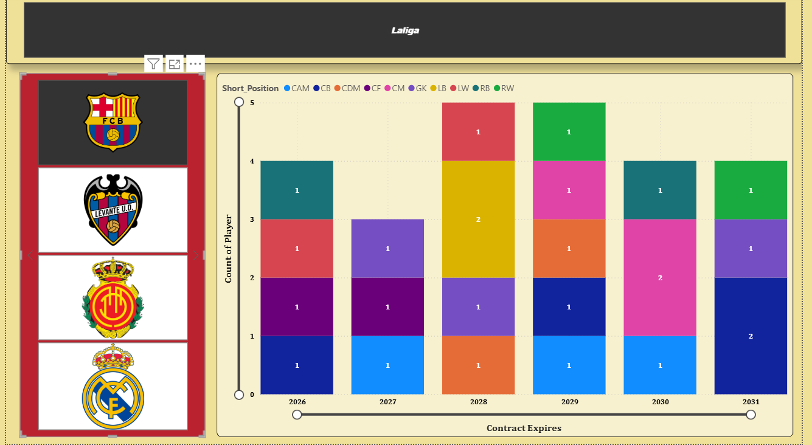

## ⚽ Football Analytics 2025
Player & Club Performance Analysis

## 📌 Project Overview

This project presents a complete end-to-end football analytics pipeline for the 2025 season.
It combines manual data collection, data cleaning in Python, statistical analysis, and interactive Power BI dashboards.

The main objective is to analyze football players and clubs across different leagues using performance, physical, financial, and structural indicators.

The project demonstrates:

Manual data sourcing

Data preprocessing & transformation

Exploratory Data Analysis (EDA)

Analytical pivot reporting

Interactive dashboard development

## 📂 Dataset
🔹 Raw Dataset

Location: data/raw/Football_Player_Club_Stats_2025_RAW.xlsx

Fully manually collected by the author.

Data gathered from official football websites and trusted public sources.

Includes player-level and club-level attributes such as:

Position

Age

Nationality

Market Value (€)

Height & Weight

Contract Expiry

League & Club information

## ⚠️ The dataset was not downloaded from any public repository.
## All research, validation, and structuring were performed manually.

🔹 Clean Dataset

Location: data/clean/Football_Player_Club_Stats_2025_CLEAN.xlsx

Created after preprocessing in Python.

Applied steps:

Removal of unnecessary columns

Standardization of column names

Missing value handling

Data type corrections

Feature engineering

## 📊 Pivot Tables Included

The clean dataset includes three pivot tables created for analytical summarization:

Position-based player distribution

League & club summary comparison

Market value aggregations

These pivot tables support fast high-level reporting and dashboard integration.

## 🐍 Python Analysis

Notebook location:
notebooks/Player_stats.ipynb

## 📚 Libraries Used

NumPy

Pandas

Matplotlib

Seaborn

SciPy

## 🔎 Analysis Performed

Descriptive statistics

Correlation analysis

Distribution analysis

Outlier detection

Position-based comparisons

Market value segmentation

Contract expiry evaluation

Python was primarily used for:

Data cleaning

Feature preparation

Statistical exploration

Pre-dashboard validation

## 📊 Power BI Dashboard

Location: dashboard/Football_Player_Club_Stats_2025_powerbi.pbix

A multi-page interactive dashboard was developed to visualize insights from the dataset.

## Page 1 – Club Value Overview

This page provides a high-level overview of club market values across selected leagues.

Compares total club values

Highlights value differences between leagues and clubs

Enables quick identification of financially strong teams

Purpose: Understand how market value is distributed among clubs.

## Page 2 – Player Value Decomposition

This page explores how total player market value is distributed by:

Position

Nationality

Age

Purpose: Identify which player characteristics contribute most to overall market value.

## Page 3 – Club Profile Analysis

This page focuses on individual club profiles.

Displays key club information

Shows squad composition

Presents position distribution

Purpose: Evaluate clubs from a structural perspective.

## Page 4 – Player Profile Analysis

This page provides a player-level overview.

Physical attributes

Performance indicators

Disciplinary and injury metrics

Purpose: Analyze players holistically.

## Page 5 – League Composition

This page analyzes overall league structure.

Domestic vs foreign players

Position distribution

Nationality diversity

Purpose: Understand squad-building patterns at league level.

## Page 6 – Global Player Distribution

This page visualizes player nationalities on a world map.

Geographic distribution

Interactive filtering

Purpose: Explore international diversity of players.

## Page 7 – Contract Timeline Analysis

This page analyzes player contract expiration periods.

Contract distribution by year

Position-based segmentation

Purpose: Support long-term squad planning.

## 📁 Project Structure
football-analytics-2025/
│
├── data/
│   ├── raw/
│   └── clean/
│
├── notebooks/
│
├── dashboard/
│   ├── Football_Player_Club_Stats_2025_powerbi.pbix
│   └── visuals/
│
└── README.md

## 🎯 Project Objectives

- Manual data collection
- Build a structured football dataset  
- Clean and preprocess real-world data  
- Perform statistical and exploratory analysis  
- Create meaningful visualizations  
- Develop interactive dashboards
- Pivot reporting
- Demonstrate end-to-end data analytics skills  

## 👤 Author

Ayan

